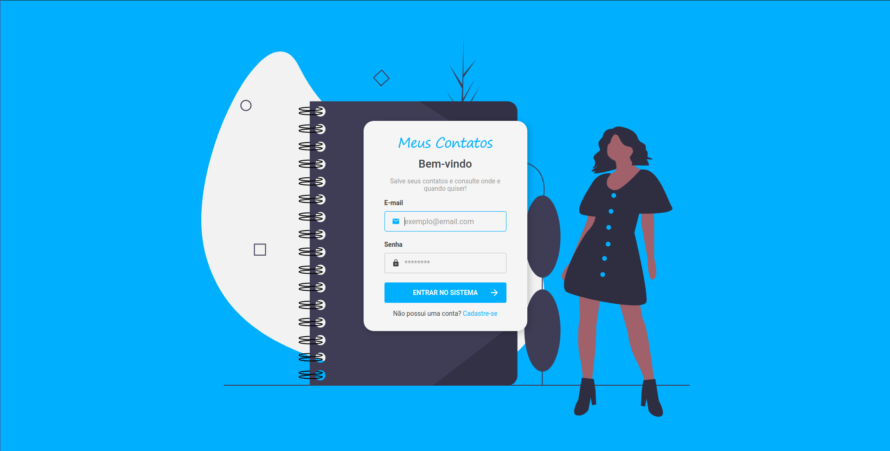
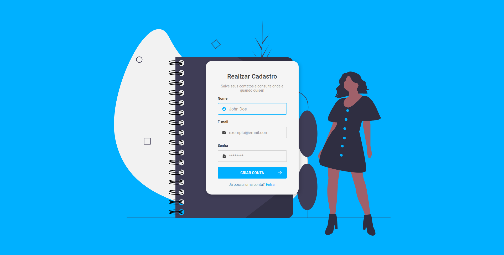
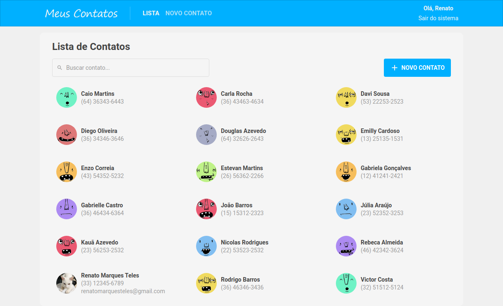
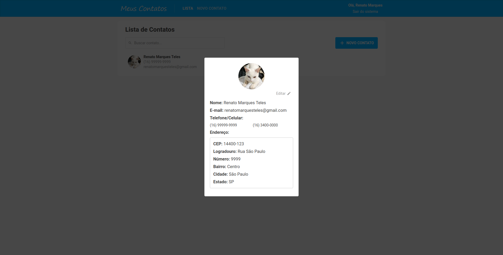
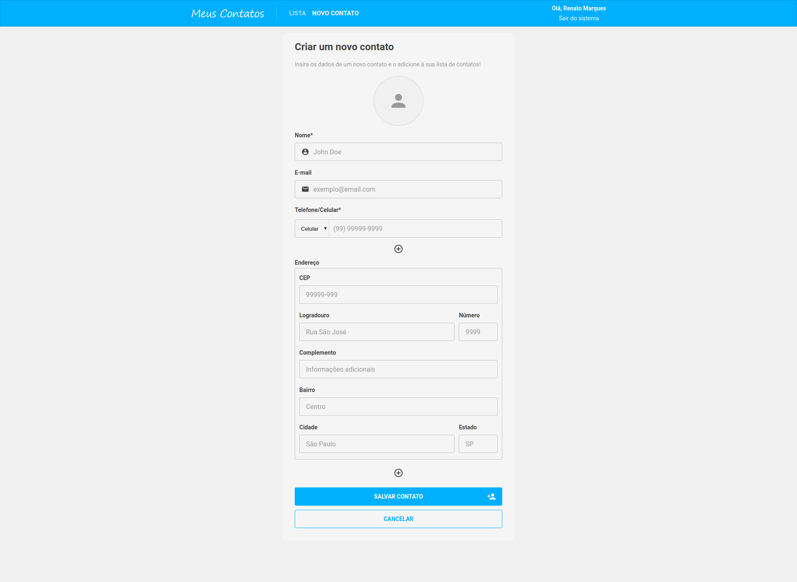

<h1 align="center">
    
</h1>

> Meus Contatos é um sistema de gerenciamento de contatos

<h1 align="center">
  
  
  
  
  
</h1>

### :computer: Configuração de Ambiente
Durante o desenvolvimento deste projeto foi utilizado o Docker para criar as imagens dos bancos de dados MySQL (principal) e Redis (filas). Para criar essas imagens certifique-se de ter o Docker CE instalado em sua máquina e em seguida rode os comandos:  
`$ docker run --name meus-contatos-mysql -e MYSQL_ROOT_PASSWORD=docker -p 3306:3306 -d mysql`  
`$ docker run --name meus-contatos-redis -p 6379:6379 -d -t redis:alpine`

> Para alterar configurações de banco dados e envio de e-mail acesse a pasta `config` em `"./backend/src/config/"`

### :rocket: Instalação do Back-end
1. Em uma pasta qualquer abra o terminal e clone este repositório  
`$ git clone https://github.com/renatomarquesteles/meus-contatos.git`
2. Acesse o diretório onde está o backend  
`$ cd backend`
3. Instale as depêndencias do projeto  
`$ yarn`
4. Rode as migrations para criar as tabelas no banco de dados  
`$ yarn sequelize db:migrate`
5. Rode a API  
`$ yarn dev`
6. Abra outro terminal no mesmo diretório e rode a fila de jobs da aplicação  
`$ yarn queue`

> É possível testar todas as rotas da API através do Insomnia:   

### :art: Instalação do Front-end

_Antes de rodar essa aplicação certifique-se que o Back-End também esteja rodando!_

1. Acesse o diretório onde está o front-end  
`$ cd frontend`
2. Instale as depêndencias do projeto  
`$ yarn`
3. Rode a aplicação (irá abrir automaticamente em `http://localhost:3000`)  
`$ yarn start`

### :star2: Protótipo

Na raiz do projeto existe um arquivo `prototipo.xd` que pode ser aberto no Adobe XD para visualizar as telas prototipadas para o sistema.

### :shipit: Preview

